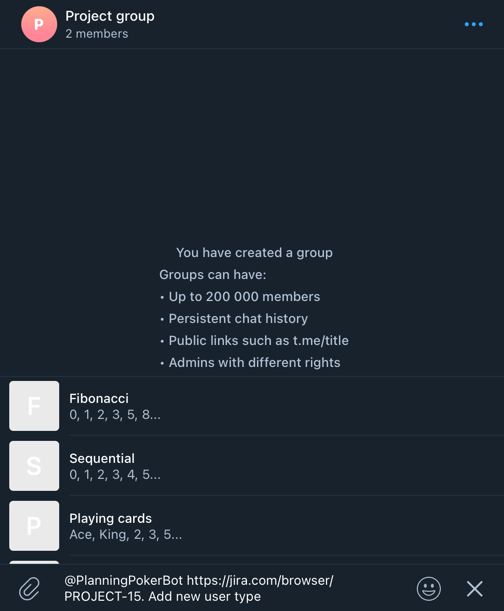
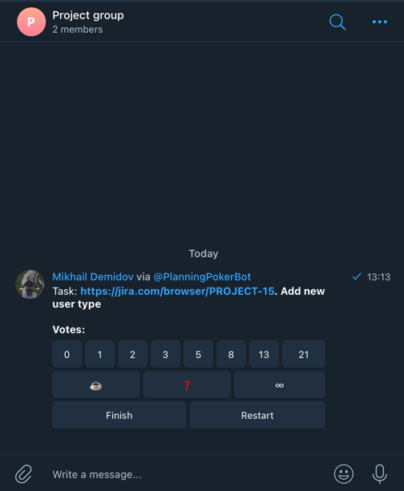
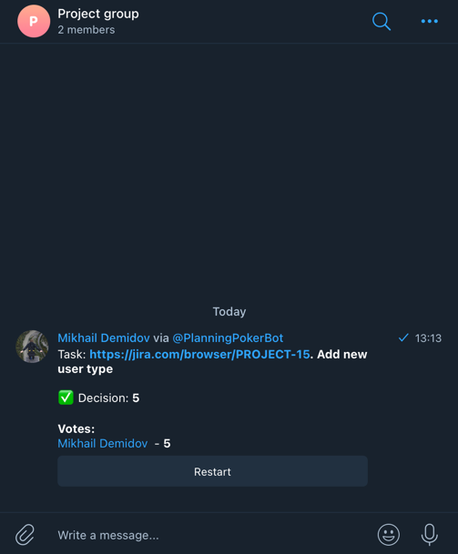

# Planning poker bot

Simple bot that allows you to estimate tasks right in telegram.

## How to use
1. Type `@PlanningPokerBot <Description of estimated task>` in message field in telegram
2. Choose deck type, one of:
    1. Fibonacci (0, 1, 2, 3, 5, 8...)
    2. Sequential (0, 1, 2, 3, 4, 5...)
    3. Playing cards (Ace, King, 2, 3, 5...)
    4. Scrum (0, 1/2, 1, 2, 3, 5...)
    5. T-Shirt (XS, S, M, L, XL, XXL)
3. Vote with your team
4. Finish poll and get decision

## Screens

